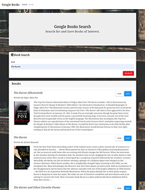
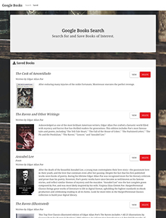

<h1 align="center">Welcome to Google Books Search 👋</h1>

### 🏠 https://googlebookscr.herokuapp.com

 

# Install

Open the above link in your browser.
 
 

# Usage

 
 
 

Users can search for books, save them in a list to review and delete them from the list.
 
 

# Description

A React-based app using MERN - MongoDB, Express, React and, Node.
 
 

# Credits

Photo by <a href="https://unsplash.com/@henrysca?utm_source=unsplash&utm_medium=referral&utm_content=creditCopyText">Henry Chuy</a> on <a href="https://unsplash.com/?utm_source=unsplash&utm_medium=referral&utm_content=creditCopyText">Unsplash</a>

Huge thanks to my tutor and AskBCS.
